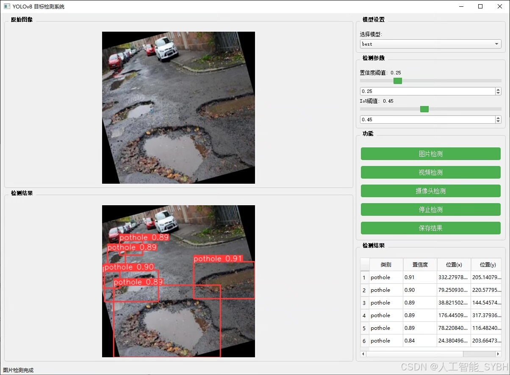
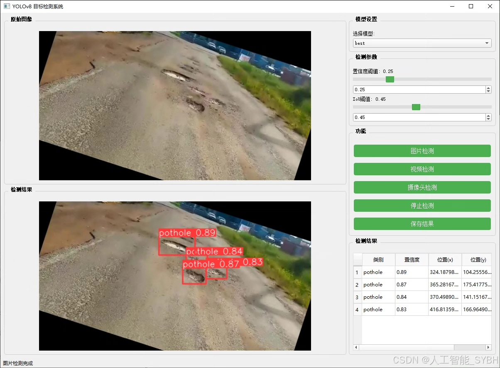
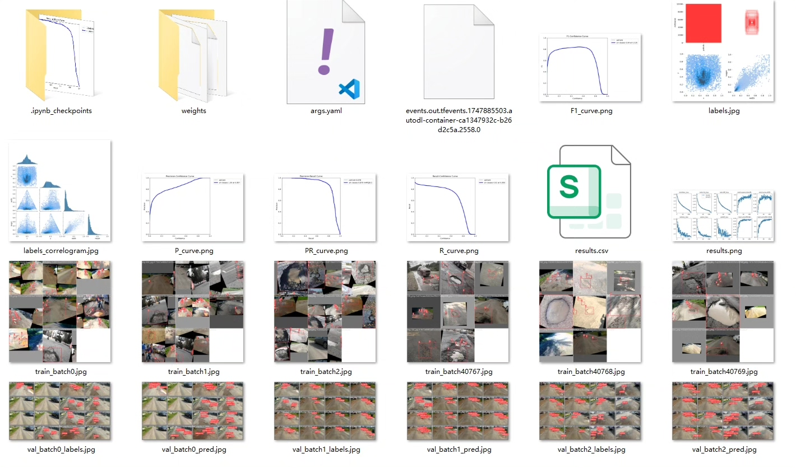
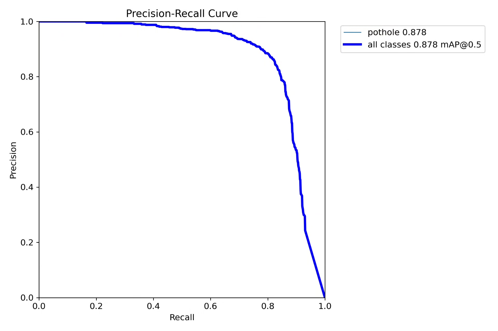
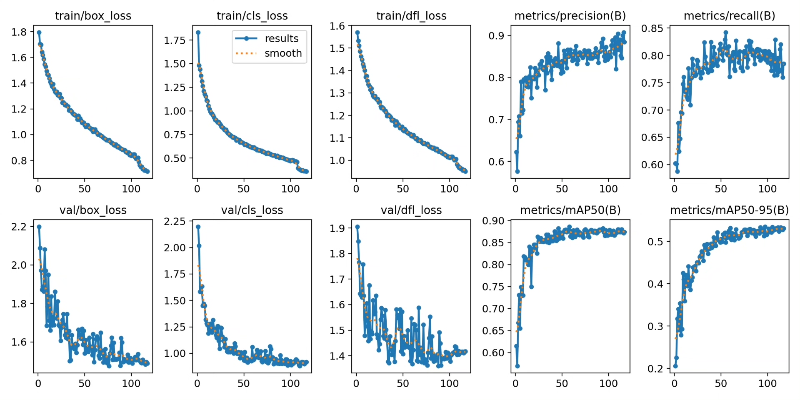
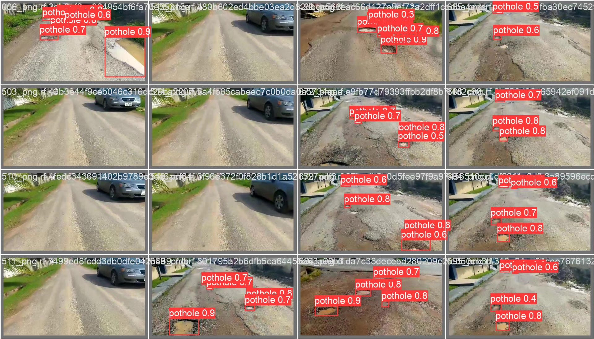
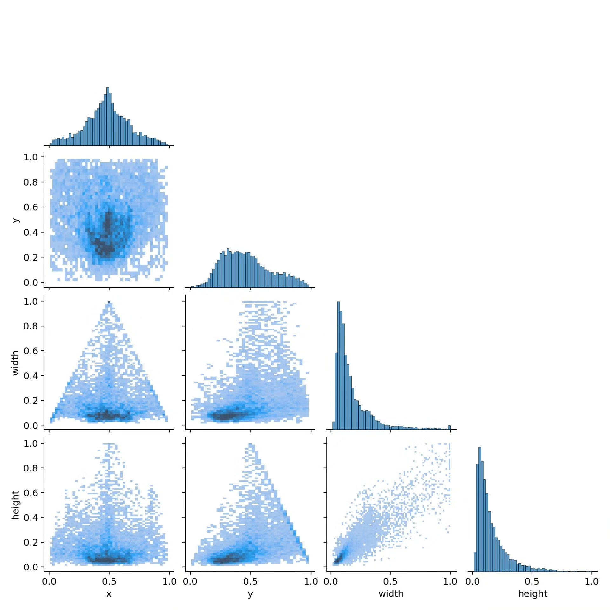

# Based on deep learning YOLOv8, a road pothole detection system

## Body

Based on the YOLOv8 object detection algorithm, this project has developed a smart detection system specifically for road pothole recognition. The system can automatically detect and locate potholes, cracks, and other defects on the road surface through real-time images or video streams, providing data support for road maintenance, traffic safety, and the construction of smart cities. The project uses a professional dataset containing 3,490 labeled images (training set 3,043, validation set 273, test set 174), which is trained using deep learning techniques to produce high-precision pothole detection models with strong generalization capabilities and robustness.

The company's products have been granted the official commercial license certification by YOLO.

We provide after-sales service.

After payment, we will provide WeChat IDs for instant questions and answers.

Environment configuration: We will provide an environment configuration tutorial, and WeChat will provide答疑.

Remote installation services: If you need remote configuration, an additional fee of 69 is required, and if the configuration fails, all fees will be refunded (specially for older computers only refunding installation fees).

Retraining the dataset: After setting up the environment, you can train on your own computer. If you need us to retrain, just pay 69 plus computing power fees (2.5 yuan/hour).

Full after-sales service

## Images

## Payment

Here is a pay link on Stripe ( https://buy.stripe.com/3cs8yP7sY87d0vu9AB ). Please contact me lonlonago@foxmail.com after funding $89, and I will send you a complete data files , thank you!

